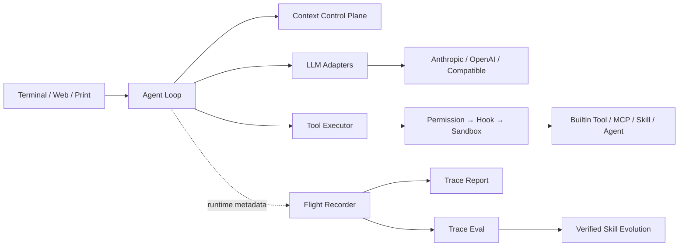
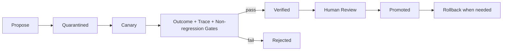

# DevMesh

> An observable, safely evolving AI coding platform for complex software engineering tasks

[](https://github.com/tdO-0/DevMesh/actions/workflows/ci.yml)

[](https://github.com/tdO-0/DevMesh/releases)


DevMesh is a local Coding Agent execution engine built with Java 21. It brings together multi-model access, the ReAct loop, context management, Tool/MCP, Skills, multi-agent collaboration, secure execution, run traces, and quality evaluation in one end-to-end system. It supports a Vim-inspired keyboard-first terminal, one-shot tasks, and a remote Web interface, and can connect to Anthropic, OpenAI, OpenRouter, and other OpenAI Chat Completions-compatible services.

## DevMesh 2.0 TUI

The interactive terminal has explicit keyboard modes. The prompt starts in `INSERT`; press `Esc` for `NORMAL`, `i` or `a` to return to editing, and `/` to open the searchable slash popup. Popup commands come from the central command registry, so user commands and aliases participate in the same filtering and selection flow.

| Key | Action |
| --- | --- |
| `i` | Enter INSERT mode |
| `a` | Enter INSERT mode after the cursor |
| `Esc` | Return to NORMAL mode or close the popup |
| `/` | Open and filter the slash command popup |
| `j` / `k`, `Down` / `Up` | Move through a popup or selector |
| `Enter` | Select a popup item or submit the prompt |
| `Tab` | Complete the highlighted slash command |
| `Ctrl+J` | Insert a newline in the prompt |
| `Ctrl+D` / `Ctrl+U` | Page the conversation down / up |

Available slash commands include `/help`, `/model`, `/provider`, `/context`, `/tools`, `/session`, `/skills`, `/clear`, `/compact`, `/permission`, `/resume`, `/rewind`, `/review`, `/sandbox`, and `/quit`. `/model` and `/provider` reuse the configured provider selector; no model names or credentials are hardcoded into the TUI.

Model runtime settings are provider and model dependent. Use `/mode`, `/thinking`, or `/model-settings` to open the keyboard popup. The popup only shows capabilities declared by the provider adapter or explicitly configured for an OpenAI-compatible/OpenRouter provider. Supported settings are sent using native request fields; unsupported and unknown settings are omitted rather than guessed. Use `/mode default` to restore provider-default behavior.

Use `/repo` to inspect the repository map, including project type, languages, build system, modules, source roots, test roots, and indexed file count. Repository metadata is supplied to the Context Control Plane selectively; source files and generated directories are not loaded wholesale.

Compatible-provider capability metadata can be declared alongside a provider when the endpoint documents support:

```yaml
providers:
  - name: compatible-reasoning
    protocol: openai-compat
    base_url: https://example.test/v1
    model: vendor/model
    supports_reasoning: true
    supports_reasoning_effort: true
    reasoning_efforts: [low, medium, high]
    supports_temperature: true
```

## Smart Coding Orchestrator

DevMesh detects the operating system, shell, project type, wrappers, and available tools before resolving build and test intents. Gradle, Maven, Node, Rust, Go, CMake, Make, and Git commands use structured `ProcessBuilder` execution with explicit working directories and timeouts. Windows uses `.bat`, `.cmd`, and PowerShell-compatible execution instead of assuming Bash.

Medium and complex first requests create a persisted Todo plan under `.devmesh/tasks/`. Use `/todo` to inspect it. Todo states are `pending`, `in_progress`, `completed`, `blocked`, `failed`, and `skipped`; the plan survives context compaction and can continue from its current task.

> This repository was organized and published in August 2026; most development took place locally before that.

<p align="center">
  
</p>

> The image shows a real model response from DevMesh Remote Web. The demo prompt does not read source code, call tools, or contain an API key or personal information.

## Core capabilities

- **Unified multi-model access**: Normalize streaming responses, Tool Calling, usage, and context-window information across Anthropic, OpenAI, and OpenAI-compatible APIs.
- **Context Control Plane**: Separate persistent sessions from named ephemeral contexts, with persisted tool results, real usage anchors, automatic summaries, and layered compaction to reduce context pollution during long tasks.
- **Progressive tool discovery**: Register built-in and MCP tools together; the model discovers capabilities through `ToolSearch` on demand, then receives only the required schemas.
- **Multi-agent collaboration**: Support SubAgents, team mailboxes, shared tasks, and Git Worktree isolation, with concurrent scheduling for read-only tools and ordered execution for writes.
- **Secure execution chain**: Route tool calls through Permission, Hook, Sandbox, and the concrete executor to constrain commands and file changes.
- **Agent Flight Recorder**: Record model calls, tool execution, tokens, caching, latency, and context pressure using OpenTelemetry GenAI semantics; prompts, parameter values, and tool output are excluded by default.
- **Trace Eval**: Generate offline run reports and use YAML policies to check tool success rates, p50/p95 latency, retries, compaction, and behavioral constraints for CI quality gates.
- **Verified Skill Evolution**: Turn successful tasks into immutable candidate Skills, publish them explicitly after quarantine, canary, paired outcomes, trace gates, and non-regression checks, with rollback support.

## Architecture overview



## Technology stack

- Java 21、Virtual Threads、Gradle
- Anthropic Java SDK、OpenAI Java SDK
- Model Context Protocol Java SDK
- JLine、Javalin
- Jackson、SnakeYAML、JUnit 5

## Engineering validation

| Check | Current result |
| --- | --- |
| Automated tests | 126 passed, 0 failed |
| Tool Schema benchmark | 13 resident schemas injected at cold start out of 21 built-in tools; estimated OpenAI-compatible usage is 30.74% lower than the full 21-tool baseline |
| 50-turn context benchmark | Three automatic compactions under a fixed 32K window; estimated average/peak context reduced by 55.49%/60.88%, with 0 failures across 50 tool-pair validations |
| GitHub Actions | Gradle Wrapper verification, tests, benchmark reproduction, and Shadow JAR packaging all pass |
| Security boundary | Local configuration, API keys, sessions, memories, and traces are excluded from version control by default |
| Release artifact | Executable `devmesh.jar` with entry point `devmesh.DevMesh` |

The Schema token figure above is an **estimate** based on canonical compact JSON character count divided by 4, not an exact count from a particular model tokenizer. The baseline, 50-turn input, average/peak formulas, per-turn sequence, and input SHA-256 are published here:

- [Engineering validation benchmark, metrics, and reproduction](benchmarks/engineering-validation.md)
- [Raw engineering validation results](benchmarks/results/engineering-validation.json)

```powershell
.\gradlew.bat engineeringValidation
```

## Quick start

### Requirements

- JDK 21 or later
- Git
- Windows, Linux, or macOS

The `2.0.0` release packages `devmesh.jar`, a Java 21 runtime, and launch scripts in one bundle for Linux, Windows, and macOS:

- Linux x64: `devmesh-jdk21-linux-x64.tar.gz`
- Windows x64: `devmesh-jdk21-windows-x64.zip`
- macOS x64: `devmesh-jdk21-macos-x64.tar.gz`

Each bundle contains this layout:

```text
devmesh.jar
runtime/       # Java 21 runtime image
bin/devmesh    # Linux/macOS launcher
bin/devmesh.bat
bin/devmesh.ps1
```

### Get the project

```bash
git clone https://github.com/tdO-0/DevMesh.git
cd DevMesh
```

### Create local configuration

The fastest way to initialize a workspace is the offline `init` command. It
creates `.devmesh/config.yaml` and the local session, task, checkpoint, and
context directories without contacting a provider:

```bash
./gradlew run --args="init"
```

For an installed launcher:

```bash
devmesh init
```

Use `--workspace <path>` to initialize another project and `--force` only when
you intentionally want to replace an existing `.devmesh/config.yaml`.

The generated configuration uses OpenRouter with the default evaluation model
and reads credentials from `OPENROUTER_API_KEY`; no key is written to disk.

To configure an existing workspace manually, use the template instead:

Windows PowerShell：

```powershell
Copy-Item .\.devmesh\config.yaml.example .\.devmesh\config.yaml
notepad .\.devmesh\config.yaml
```

Linux or macOS:

```bash
cp .devmesh/config.yaml.example .devmesh/config.yaml
```

Minimal Provider configuration:

```yaml
providers:
  - name: my-provider
    protocol: openai-compat
    base_url: https://example.com/v1
    api_key: "replace-with-your-api-key"
    model: replace-with-your-model-id
```

OpenRouter can be configured with the dedicated `openrouter` protocol. The `base_url` is optional and defaults to `https://openrouter.ai/api/v1`:

```yaml
providers:
  - name: openrouter
    protocol: openrouter
    model: openai/gpt-4o-mini
    api_key: "replace-with-your-openrouter-api-key"
    headers:
      HTTP-Referer: https://your-site.example
      X-Title: DevMesh
```

Real configuration, API keys, sessions, memories, and run traces are excluded by `.gitignore` and will not be uploaded to GitHub.

### Build and run

Windows：

```powershell
.\gradlew.bat test shadowJar
java -jar .\build\libs\devmesh.jar
```

Linux or macOS:

```bash
./gradlew test shadowJar
java -jar ./build/libs/devmesh.jar
```

Common launch modes:

```powershell
# Specify a configuration file
java -jar .\build\libs\devmesh.jar .\.devmesh\config.yaml

# One-shot task
java -jar .\build\libs\devmesh.jar .\.devmesh\config.yaml -p "Analyze the current project and suggest improvements"

# Remote Web mode
java -jar .\build\libs\devmesh.jar .\.devmesh\config.yaml --remote=127.0.0.1:18888
```

To list all CLI options without loading a configuration file:

```bash
java -jar ./build/libs/devmesh.jar --help
```

To print the installed DevMesh version without loading a configuration file:

```bash
java -jar ./build/libs/devmesh.jar --version
```

### Local chat management

DevMesh can manage local SQLite-backed chats without loading provider
configuration:

```bash
devmesh chat new "Fix authentication" --workspace /path/to/project
devmesh chat list --workspace /path/to/project
devmesh chat search authentication --workspace /path/to/project
devmesh chat rename <session-id> "New title" --workspace /path/to/project
devmesh chat archive <session-id> --workspace /path/to/project
devmesh chat delete <session-id> --workspace /path/to/project
```

The default database is `.devmesh/devmesh.db`. See
[Persistence and Chat Management](docs/persistence-chat-management.md) for
schema, migration, transaction, and compatibility details.

### Demo

The repository includes a reproducible, approximately 10-minute demo covering the build, Web interaction, Trace Eval, and Verified Skill Evolution:

- [DevMesh demo guide](examples/demo-guide.md)
- [Cross-platform release packaging](docs/release-packaging.md)

## Trace analysis and quality gates

Run traces are written to `.devmesh/traces/*.jsonl` by default. Traces store only operation names, durations, tokens, status, and parameter names; they do not store prompts, API keys, command contents, file contents, or tool return values.

```powershell
# Text report
java -jar .\build\libs\devmesh.jar --trace-report .\.devmesh\traces

# JSON report
java -jar .\build\libs\devmesh.jar --trace-report .\.devmesh\traces --output-format json

# Run the reliability gate; exits with code 2 on failure
java -jar .\build\libs\devmesh.jar `
  --trace-eval .\.devmesh\traces `
  --trace-policy .\evals\agent-reliability.yaml
```

Set `DEVMESH_TRACE=false` to disable recording, or use `DEVMESH_TRACE_DIR` to change the trace directory.

## Skill Evolution workflow



Candidate Skills are not automatically added to the production catalog. The core lifecycle can be verified without configuring a model API:

```powershell
.\gradlew.bat test --tests devmesh.evolution.*
```

## Project structure

```text
DevMesh/
├─ .devmesh/                 # Configuration templates and project Skills
├─ docs/                     # Architecture, learning, and validation docs
├─ evals/                    # Trace and Skill Evolution policies
├─ examples/                 # Demo and reproducible experiment inputs
├─ src/main/java/devmesh/    # Core platform implementation
├─ src/test/java/devmesh/    # Unit and integration tests
├─ build.gradle.kts
└─ README.md
```

## Documentation

- [AI coding platform architecture](docs/ai-coding-platform-architecture.md)
- [Architecture and Skill Evolution](docs/architecture-and-skill-evolution.md)
- [Agent execution guide](docs/agent-execution-guide.md)
- [Skill Evolution guide](docs/skill-evolution-guide.md)
- [End-to-end validation guide](docs/devmesh-end-to-end-validation.md)
- [Contributing](CONTRIBUTING.md)

## Author

**td**

The project brand, platform integrations, context management, run-trace evaluation, and verifiable Skill Evolution capabilities are maintained by **td**. Copyright and licensing terms for third-party Skills are defined by the `LICENSE.txt` files in their respective directories.
